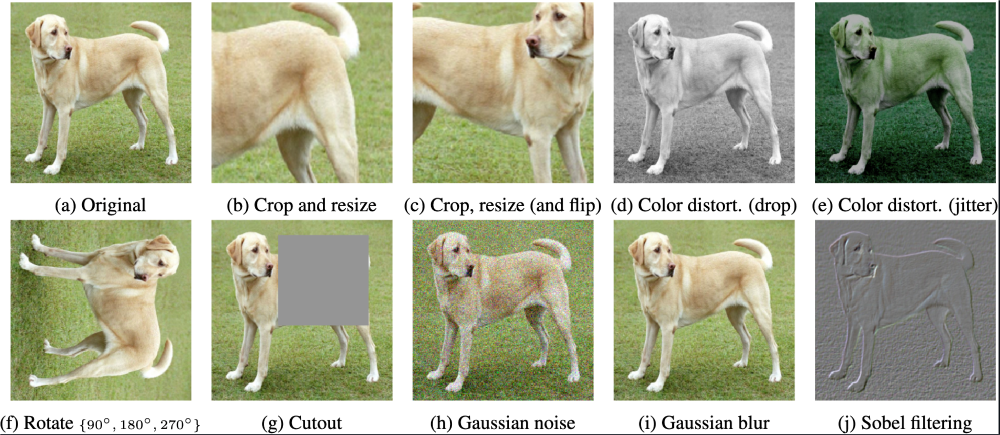
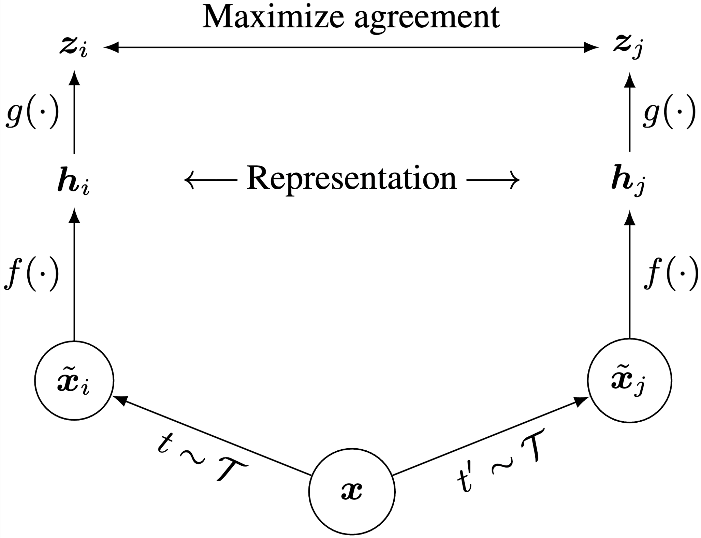
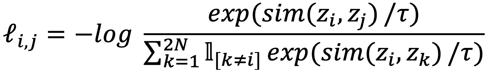
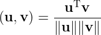

# Simple Introduction to Contrastive Learning
Contrastive learning is a self-supervised learning technique that has gained significant traction in the machine learning community. Its primary goal is to learn effective representations of data without the need for labeled samples. In contrastive learning, the model is typically trained using a loss function that encourages the representation of similar sample to be close in the feature space while pushing the representations of dissimilar sample farther apart. This approach leverages data augmentation techniques to create positive pairs from the same data instance and negative pairs from different instances.

## 1 SimCLR
Various frameworks and algorithms have been proposed for Contrastive learning. Among these methods, **SimCLR (A Simple Framework for Contrastive Learning of Visual Representations) [1]** stands out as a remarkable work. SimCLR learns representations by maximizing agreement between differently augmented views of the same data example using a contrastive loss in the latent space. It not only simplifies the process of contrastive learning but also significantly improves the performance of visual representation learning. 

### 1.1 Data Augmentation
As previously mentioned, contrastive learning falls under the umbrella of self-supervised learning. Since we do not have readily available labeled data, we need to construct similar data (positive examples) and dissimilar data (negative examples) ourselves. So, how does SimCLR go about building these two types of data? In SimCLR, positive and negative examples are constructed as follows:

- Positive examples: For each input image, SimCLR creates augmented versions through random transformations (e.g., rotation, cropping, color distortion). The original image and one of its transformed versions form a positive pair, as these transformations preserve the image's intrinsic content, making them close in the feature space.

- Negative examples: Negative examples are the transformed versions of other images in the same batch. Since each image is different, their transformed versions should be far apart in the feature space. Thus, each image in the batch forms negative pairs with all other transformed images in the batch.

This approach allows SimCLR to learn effective visual representations through contrastive learning in a self-supervised manner, leveraging large amounts of unlabeled data without manual labeling. 

### 1.2 Framework
SimCLR proposes a method for constructing negative samples based on the idea that an input image is randomly transformed through data augmentation to produce two images, $x_i$ and $x_j$. These images are then passed through an encoder to obtain their respective representations, $h_i$ and $h_j$. A nonlinear fully connected layer is then used to derive the final representations, $z_i$ and $z_j$. The learning task is to maximize the similarity between these two representations, $z_i$ and $z_j$, for the same image. Once the network has been trained, $h_i$ and $h_j$ can be used as feature representations of the image for downstream tasks.

    

### 1.3 Contrastive Loss
SimCLR employs a contrastive loss function known as the _NT-Xent_ (Normalized Temperature-scaled Cross Entropy Loss). This loss function ensures that the feature representations of positive pairs are close while those of negative pairs are far apart. The NT-Xent loss is defined as:

    

where 𝜏 is a temperature parameter, _2N_ is the number of samples in a batch, and sim(u,v) denotes the cosine similarity between two vectors 𝑢 and 𝑣 defined as following:

    

### 1.4 Performance and Impacts of SimCLR
- SimCLR achieves significant improvements over previous methods in self-supervised and semi-supervised learning on ImageNet at that time, when compared to supervised learning methods. It has paved the way for further research in self-supervised learning and has influenced many subsequent works in the domain of contrastive learning. The principles of contrastive learning used in SimCLR have been applied to other domains beyond computer vision, such as such as natural language processing and multi-modal learning.
 
- SimCLR proposed a symmetric architecture for contrastive learning which is relatviely simple and effective. Furthermore, the structural framework developed by SimCLR has emerged as a canonical element in various other models employing contrastive learning techniques.
 
- SimCLR has demonstrated that self-supervised learning methods can scale effectively with larger datasets and models.

## 2 Contrastive Learning in Multimodal Learning
In the current AI era, multimodal learning—utilizing diverse media such as text, images, and audio for machine learning—has gained significant prominence. Integrating language and images is particularly crucial due to their central roles in human understanding and communication. To address this need, the CLIP (Contrastive Language–Image Pre-training) model[2] was developed to enable effective language-image fusion. CLIP leverages contrastive learning to combine language and image information. The model learns to extract semantic information from images and generate corresponding textual descriptions by contrasting the relationships between language and image content, thereby enhancing its multimodal learning capabilities.

CLIP consists of two main components: an image encoder and a text encoder. The image encoder is responsible for converting images into vector representations, while the text encoder converts textual descriptions into corresponding vector representations. CLIP learns the mapping between language and images by contrasting the relationships between these vector representations.

### 2.1 Natural Language Supervision
Unlike traditional computer vision approaches that rely on manually labeled images, CLIP learns from the vast amount of text available on the internet. This opens up a massive and diverse source of supervision, enabling the model to learn more robust and generalizable representations.

### 2.2 Contrastive Learning in CLIP
CLIP achieves contrastive learning by jointly training an image encoder and a text encoder to predict the correct pairings of image-text pairs. The contrastive loss used in CLIP, similar to SimCLR, calculates the similarity and dissimilarity between images and text. This encourages similar content to converge in the vector space while pushing dissimilar content apart. Through this process, CLIP learns deep semantic associations between images and text. 

### 2.3 Extensive Pre-training enabling Zero-shot Transfer
CLIP is extensively pre-trained using a straightforward yet powerful method that harnesses a dataset containing over 400 million image-text pairs sourced from diverse online repositories. These pairs are curated by querying images with specific terms and capturing their associated text. This extensive pre-training enables CLIP to excel in recognizing a broad spectrum of objects and concepts simply by providing descriptive text prompts, without the need for task-specific fine-tuning.

### 2.4 Performance and Impacts of CLIP
- CLIP presented a novel approach to learning image representations that has not been explored extensively before. It demonstrates the potential of natural language supervision and contrastive learning for computer vision tasks.

- In the CLIP paper, many strong experiments results are provided, showing that CLIP can achieve state-of-the-art performance on various downstream tasks without the need for any additional training data.

- CLIP is highly scalable and efficient, allowing it to learn representations from massive datasets with minimal compute requirements. This makes it practical for real-world applications.

## Conclusion
In conclusion, SimCLR and CLIP represent significant advancements in contrastive learning. These models have not only advanced the use of unlabeled data but also pioneered cross-modal understanding and generalizable AI. SimCLR's approach to data augmentation and agreement maximization has produced robust, discriminative representations, while CLIP's integration of language and vision has redefined zero-shot learning and multimodal applications. As we continue to build upon the foundation laid by SimCLR and CLIP, they promise a future where AI systems are more adaptable and human-like.

## References
[1] Chen, T., Kornblith, S., Norouzi, M., & Hinton, G. (2020, November). A simple framework for contrastive learning of visual representations. _In International conference on machine learning_ (pp. 1597-1607).

[2] Radford, A., Kim, J. W., Hallacy, C., Ramesh, A., Goh, G., Agarwal, S., ... & Sutskever, I. (2021, July). Learning transferable visual models from natural language supervision. _In International conference on machine learning_ (pp. 8748-8763).

